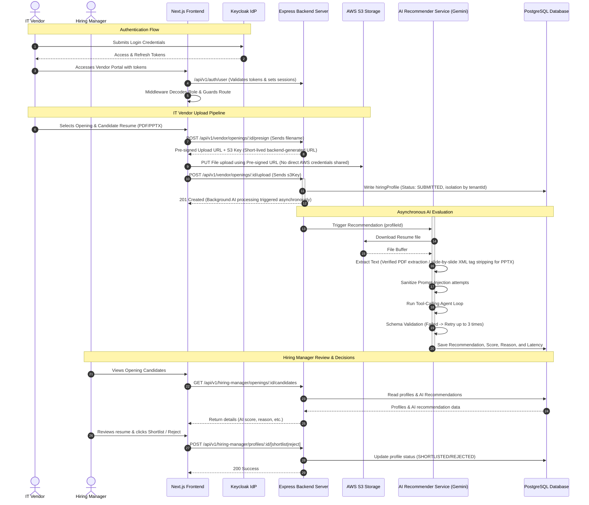
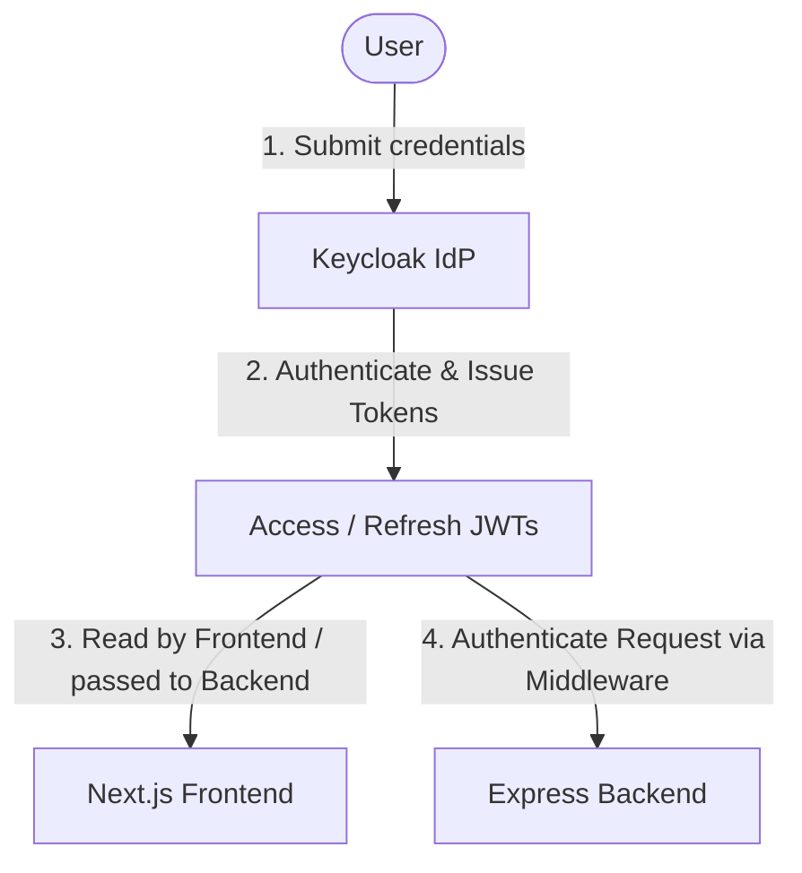
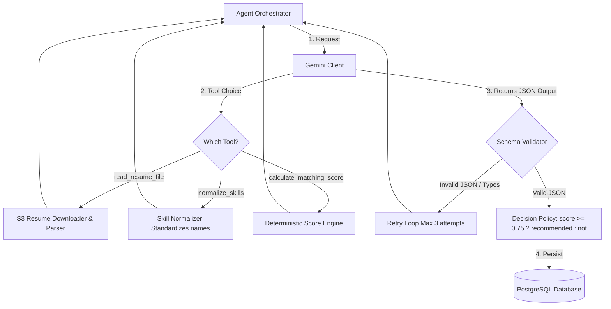
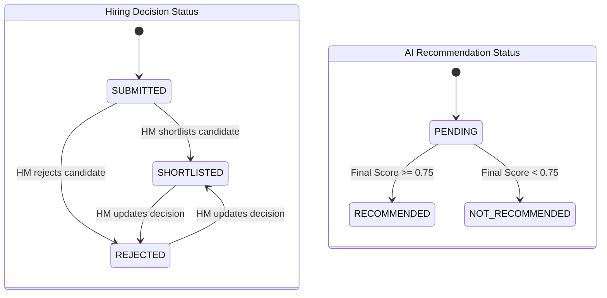
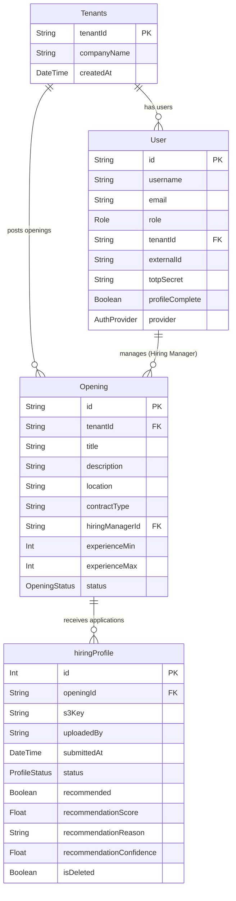

# <p align="center"><br>Zelosify Candidate Evaluation & Recommendation Platform</p>

Zelosify is an enterprise-grade monorepo application designed to streamline candidate profiles sourcing and evaluation. It bridges the gap between **IT Vendors** (who upload and track candidate resumes) and **Hiring Managers** (who review and manage candidates guided by structured, AI-generated matching scores and decision justifications). 

Powered by **Next.js 15**, **Express**, **Prisma ORM (PostgreSQL)**, **Keycloak Identity Provider**, and **Google Gemini LLM**, the platform delivers real-time analytics, automated resume parsing, strict multi-tenant isolation, and a deterministic skill/experience assessment engine.

---

## 🗺️ Overall Application Flow

The end-to-end user lifecycle coordinates secure authentication, direct S3 resume uploads via pre-signed URLs, background AI extraction, and hiring manager decisions.



---

## 🛠️ Technology Stack

| Layer | Technology / Package | Purpose |
| :--- | :--- | :--- |
| **Frontend** | Next.js 15, React 19, Redux Toolkit, Tailwind CSS, Framer Motion, Recharts, Lucide React, Shadcn/ui | Premium user dashboards, state management, charting, and fluid animations. |
| **Backend** | Node.js (TypeScript), Express, Prisma ORM, Helmet, CORS, Cookie-Parser, express-session | API gateway, request routing, data management, and secure session state. |
| **Security / Identity**| Keycloak IdP, JSON Web Tokens (JWT), Otplib (TOTP), Jwks-rsa | Secure user authentication, role separation (RBAC), and multi-factor authentication (MFA). |
| **Storage / Media** | AWS S3, multer, `@aws-sdk/s3-request-presigner` | Secure document storage via short-lived pre-signed URLs. |
| **AI / NLP** | Google Gemini (SDK client), pdf-extraction, tar | Resume text extraction (PDF/PPTX), LLM orchestrator, skill normalization. |
| **Testing** | Vitest | Backend unit and integration testing. |

---

## 🔐 Security & Tenant Isolation

### A. Authentication & Token Lifecycle
Keycloak functions as the identity manager. JWT signatures are verified by the backend through a JWKS client:


### B. Next.js Routing Middleware
The frontend interceptor (`middleware.js`) decodes incoming JWTs to verify expiration and user role, dynamically routing clients:
* Redirects authenticated users from `/login` directly to their dashboard.
* Restricts `/vendor/*` paths to users with the `IT_VENDOR` role.
* Restricts `/hiring-manager/*` paths to users with the `HIRING_MANAGER` role.

### C. Backend Authorization Guardrails
Every request goes through sequential validation to ensure data privacy:
```text
Incoming Request
      ↓
[1. JWT Authentication] ──► Validates signature & expiration
      ↓
[2. Role Authorization] ──► Asserts user has required role (e.g., 'HIRING_MANAGER')
      ↓
[3. Tenant Isolation]   ──► Asserts request.user.tenantId === opening.tenantId
      ↓
[4. Resource Ownership] ──► Asserts opening.hiringManagerId === request.user.id
      ↓
[5. Input Validation]   ──► Validates request query, body, and parameter types
      ↓
[6. Execution]          ──► Controller executes service logic
```

> [!IMPORTANT]
> **Vendor Isolation Guard:** IT Vendors cannot view AI match recommendations, scoring, or reasoning. These fields are strictly stripped from vendor API responses to prevent data leaks.

---

## 🧠 Asynchronous AI Recommendation Pipeline

Resumes uploaded by vendors are processed asynchronously (using non-blocking `setImmediate` cycles) to determine candidate compatibility against job openings.



### Pipeline Mechanics
1. **Multi-Format Parsing**:
   - **PDFs**: Text is extracted via `pdf-extraction`.
   - **PPTXs**: Decompressed slide-by-slide utilizing node ZIP/tar streams to read core XML files natively. If native extraction fails, fallback ASCII regex indexing is applied.
2. **Prompt-Injection Defense**:
   - Resumes are categorized as untrusted source inputs. 
   - Content is never directly concatenated into LLM system prompts; instead, it is retrieved via the `read_resume_file` tool call during the Gemini tool-execution phase.
   - Override commands (e.g., `"ignore previous instructions"`) are filtered out, and the text is capped at 15,000 characters.
3. **Structured Tool-Calling Loop**:
   - The Gemini agent leverages custom tools (`read_resume_file`, `normalize_skills`, and `calculate_matching_score`).
   - The JSON response is verified against the target database schema. If validation fails, the orchestrator triggers a retry (capped at 3 attempts).
4. **Deterministic Scoring Engine**:
   $$\text{Final Score} = (0.5 \times \text{Skill Match}) + (0.3 \times \text{Experience Match}) + (0.2 \times \text{Location Match})$$
   - **Experience Match**: $1.0$ if experience lies within `experienceMin` and `experienceMax`, $0.8$ if it exceeds `experienceMax`, and $0.0$ if it is below `experienceMin`.
   - **Skill Match**: Percentage of required skills identified in the candidate resume.
   - **Location Match**: $1.0$ if locations match or the role is remote, $0.5$ if there is a mismatch on an onsite role.

---

## 🚦 Status & Decision Lifecycles

The application processes statuses through two independent lifecycles: **Candidate Profile Status** (hiring workflow) and **AI Recommendation Status** (AI scoring).



---

## 🗄️ Database Schema (Prisma)

The PostgreSQL schema ensures strict structural relationships and tenant grouping.



---

## 📂 Project Directory Structure

```text
zelosify-monorepo/
├── Zelosify-Backend/               # Node.js Express API Server
│   └── Server/
│       ├── prisma/                 # Database Schema and Migrations
│       │   └── schema.prisma
│       ├── src/
│       │   ├── controllers/        # Express Route Handlers (Auth, Vendor, HM)
│       │   ├── middleware/         # Security & RBAC Middleware
│       │   ├── routes/             # Route Mapping definitions
│       │   ├── services/           # Business Logic (AWS S3, Keycloak, Gemini)
│       │   ├── scripts/            # Helper Connection and Testing Scripts
│       │   └── index.ts            # App Entry Point
│       ├── tests/                  # Integration & Unit Tests
│       ├── package.json
│       └── tsconfig.json
│
├── Zelosify-Frontend/              # Next.js 15 Client Portal
│   ├── public/                     # Static Assets and Logos
│   │   └── assets/
│   │       ├── images/
│   │       └── logos/
│   ├── src/
│   │   ├── app/                    # Routing Layouts and Dashboards
│   │   ├── components/             # Reusable UI Components
│   │   ├── hooks/                  # Custom Redux Wrappers & Hooks
│   │   ├── redux/                  # Redux Toolkit Stores and Slices
│   │   ├── utils/                  # Fetch Clients and Formatters
│   │   └── middleware.js           # Route Guards & Decoders
│   ├── package.json
│   └── tailwind.config.mjs
│
├── architecture.md                 # System Flow Report
├── project.md                      # UI and API Flow Specifications
├── zelosify-realm.json             # Keycloak Realm Configuration
└── README.md                       # Main Repository Readme
```

---

## 💻 Development Setup

### Prerequisites
* **Node.js**: v18.x or above
* **PostgreSQL**: Local running instance or cloud database URI
* **Keycloak**: Running container with the Zelosify realm configuration loaded (`zelosify-realm.json`)
* **AWS S3 Bucket**: For resume uploads

---

### 1. Backend Server Setup

1. Navigate to the Server directory:
   ```bash
   cd Zelosify-Backend/Server
   ```
2. Install dependencies:
   ```bash
   npm install
   ```
3. Configure your environment variables. Create a `.env` file based on the local specifications:
   ```env
   PORT=8000
   DATABASE_URL="postgresql://<username>:<password>@localhost:5432/zelosify?schema=public"
   KEYCLOAK_SERVER_URL="http://localhost:8080"
   KEYCLOAK_REALM="zelosify"
   KEYCLOAK_CLIENT_ID="backend-client"
   AWS_ACCESS_KEY_ID="your_aws_key"
   AWS_SECRET_ACCESS_KEY="your_aws_secret"
   AWS_REGION="us-east-1"
   S3_BUCKET_NAME="zelosify-resumes"
   GEMINI_API_KEY="your_gemini_api_key"
   ```
4. Generate the Prisma client and apply database migrations:
   ```bash
   npx prisma generate
   npx prisma migrate dev
   ```
5. Spin up the development server:
   ```bash
   npm run dev
   ```

---

### 2. Frontend Client Setup

1. Navigate to the Frontend directory:
   ```bash
   cd Zelosify-Frontend
   ```
2. Install dependencies:
   ```bash
   npm install
   ```
3. Setup the local `.env` configuration pointing to Keycloak and Backend Server:
   ```env
   NEXT_PUBLIC_API_URL="http://localhost:8000/api/v1"
   NEXT_PUBLIC_KEYCLOAK_URL="http://localhost:8080"
   NEXT_PUBLIC_KEYCLOAK_REALM="zelosify"
   NEXT_PUBLIC_KEYCLOAK_CLIENT_ID="frontend-client"
   ```
4. Start the development server (configured on port `5173`):
   ```bash
   npm run dev
   ```

---

### 3. Running Automated Tests

Run backend unit and integration tests using Vitest:
```bash
cd Zelosify-Backend/Server
npm run test
```

---

## 📐 Frontend Development Standards

The frontend enforces strict standards for state management using **Redux Toolkit** and **Custom Hooks** to separate UI from API and business logic.

* **Slices**: Must contain `isLoading` and `error` states, define async thunks inside `extraReducers`, and export structured selectors.
* **Hooks**: Wrap selectors and dispatch actions in custom hooks (e.g., `use[ModuleName]`). Use `useCallback` to prevent unnecessary component re-renders.
* **Axios Client**: All network calls must pass through the Axios instance to attach Bearer tokens automatically.

For detailed guidelines, see the [Frontend Redux Standards Guide](./Zelosify-Frontend/frontend-rules/FRONTEND_REDUX_STANDARDS_GUIDE.md).

---

<p align="center"><b>Developed by Krish D Shah</b></p>
