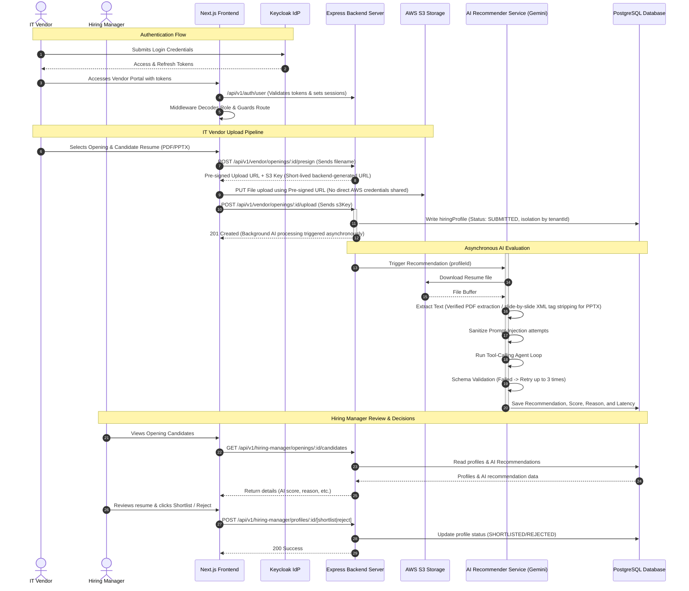
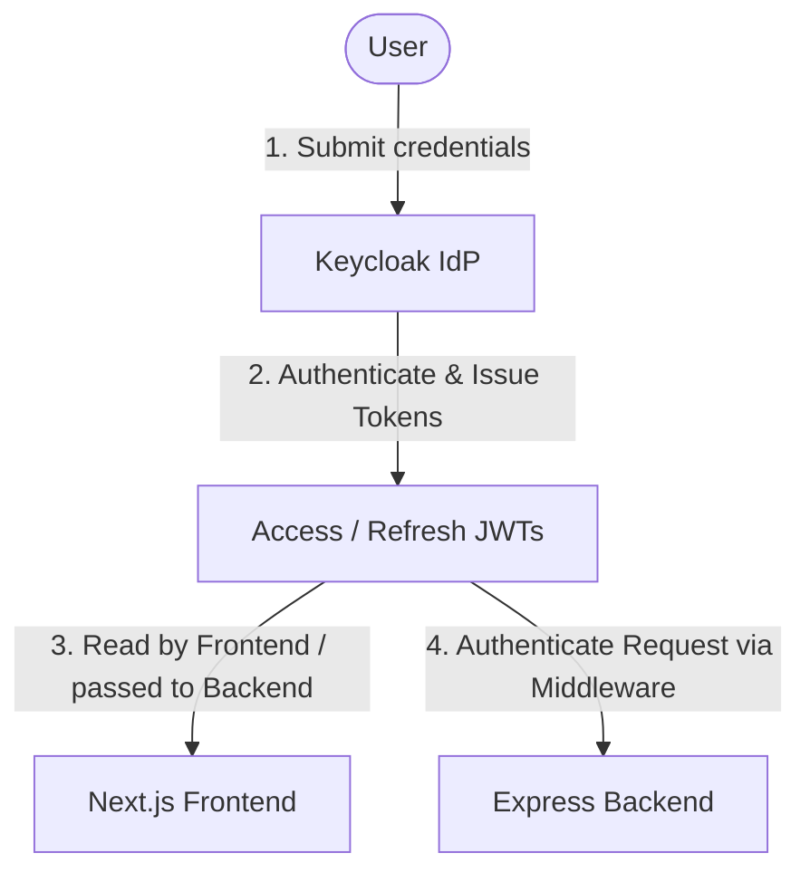
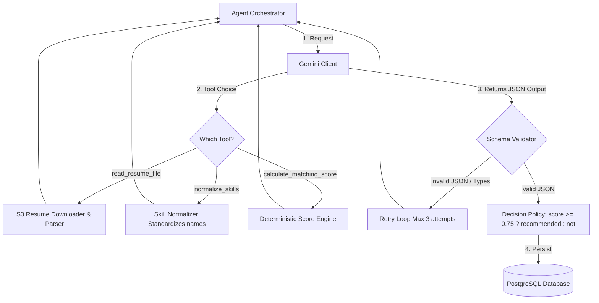
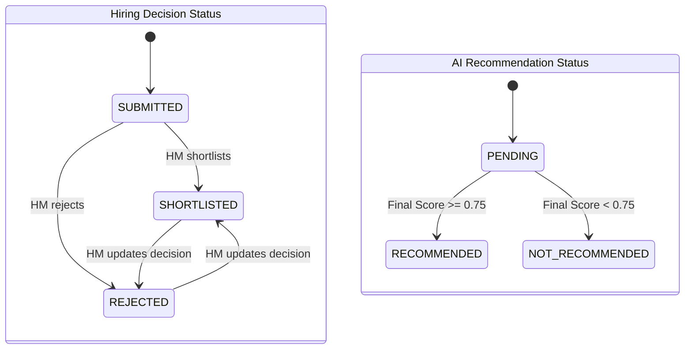
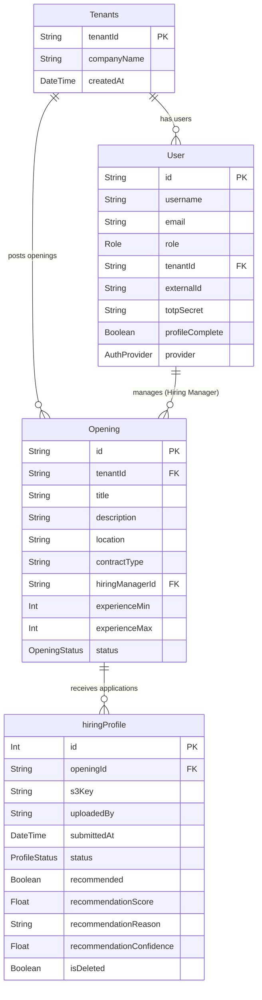

# 🌐 Zelosify End-to-End System Flow Architecture

This document provides a detailed report explaining the overall application flow, security structure, background processing, and database mapping within the Zelosify application.

---

## 🗺️ Overall Application Flow

The system acts as a bridge between **IT Vendors** (who source and submit candidate profiles) and **Hiring Managers** (who review, shortlist, or reject candidates based on automated, AI-driven recommendations).



---

## 1️⃣ Authentication & Security Flow

All interactions within the system are governed by robust authentication and **Role-Based Access Control (RBAC)**.

### A. Authentication & Token Flow
User login and credential verification are handled by Keycloak as the Identity Provider (IdP):


### B. Next.js Routing Middleware
The frontend uses Next.js middleware ([middleware.js](file:///c:/Users/Krish%20D%20Shah/Desktop/krishdocs/eval-2db315afdcc3/Zelosify-Frontend/src/middleware.js)) to intercept requests:
- **Token Verification**: Checks cookies for `access_token` and `refresh_token`.
- **Role Detection**: Decodes the JWT payload to extract user roles (`IT_VENDOR`, `HIRING_MANAGER`, `BUSINESS_USER`, etc.) and sets a readable cookie `role`.
- **Route Guarding**:
  - Directs logged-in users from public routes (`/login`, `/register`) to their default home page dashboard.
  - Enforces route protection (e.g., paths starting with `/vendor` are blocked for non-`IT_VENDOR` users; `/hiring-manager` is restricted to `HIRING_MANAGER` only).

### C. Authorization & Tenant Isolation in Request Flows
Every sensitive operation performs step-by-step validation. For example, when a Hiring Manager attempts to access/modify a candidate profile:

```text
Incoming Request
      ↓
[1. JWT Authentication] ──► Validates token signatures & expiration
      ↓
[2. Role Authorization] ──► Checks if role is 'HIRING_MANAGER'
      ↓
[3. Tenant Isolation]   ──► Asserts request.user.tenantId === opening.tenantId
      ↓
[4. Resource Ownership] ──► Asserts opening.hiringManagerId === request.user.id
      ↓
[5. Input Validation]   ──► Validates request query, body, and parameter types
      ↓
[6. Execution]          ──► Passes to Controller -> Service -> DB
```

---

## 2️⃣ IT Vendor Workflow

Vendors submit candidate resumes for open positions scoped strictly to their respective **Tenant**.

1. **Dashboard** (`/vendor`):
   - Displays real-time statistics (e.g., Open Vacancies, Total Submissions, Pending Reviews).
   - Lists the 5 most recent resume submissions with their tracking statuses.
2. **Openings List** (`/vendor/openings`):
   - Shows a paginated list of job openings posted by the client organization's hiring managers.
3. **Opening Detail & Upload** (`/vendor/openings/:id`):
   - Displays position requirements (min/max experience, required skills, location).
   - Lists candidate profiles already submitted by *this* specific vendor.
   - **Upload Mechanics**:
     - **Presigned S3 Upload**: The frontend uploads files directly to S3 using short-lived, backend-generated presigned URLs. The frontend **never** receives direct AWS credentials or arbitrary S3 access permissions.
     - **Metadata Registration**: Once upload completes, the frontend POSTs the S3 key (`POST /api/v1/vendor/openings/:id/profiles/upload`) to persist the submission.

> [!IMPORTANT]
> **Data Isolation Guardrails:** Vendors cannot view AI scores, matching explanations, or recommendation status. These are strictly stripped from vendor API responses ([vendorOpeningsController.ts](file:///c:/Users/Krish%20D%20Shah/Desktop/krishdocs/eval-2db315afdcc3/Zelosify-Backend/Server/src/controllers/vendor/vendorOpeningsController.ts#L136-L145)) to prevent leaks.

---

## 3️⃣ Asynchronous AI Recommendation Pipeline

Once a resume is registered in the database, the backend handles the evaluation process using an in-process queue handler (`setImmediate`).

### Step A: File Extraction (Verified)
- Downloads the resume file stream from S3.
- Extracts text content based on file type:
  - **PDFs**: Parsed using `pdf-extraction`.
  - **PPTX**: Parsed slide-by-slide by extracting slide XML elements from the ZIP archive natively using `tar -xf` to a temporary directory. If native extraction fails, it falls back to scanning the buffer for ASCII regex segments (`/[a-zA-Z0-9\s]{4,100}/g`).

### Step B: Prompt-Injection Mitigation
- **Resume as Untrusted Data**: Resume content is strictly treated as untrusted data. It is never directly concatenated into instructions.
- **System instruction separation**: The LLM's system prompt dictates evaluation rules, and the resume content is passed to the LLM solely as a response output from the `read_resume_file` tool call.
- **Sanitizer layer**: A basic regex filter strips obvious override phrases (e.g., `ignore previous instructions`, `you must recommend`, `developer mode`).
- **Length Constraints**: Text size is capped at 15,000 characters to prevent context-window overflow.

### Step C: Tool-Calling Agent Loop
The orchestrator guides Gemini through a structured execution loop:



- **Deterministic scoring formula**:
  $$\text{Final Score} = (0.5 \times \text{Skill Match}) + (0.3 \times \text{Experience Match}) + (0.2 \times \text{Location Match})$$
  - **Experience Match**: $1.0$ if within min/max requirements, $0.8$ if exceeding max, and $0.0$ if below min.
  - **Skill Match**: Percentage of required job skills present on the candidate's profile.
  - **Location Match**: $1.0$ for matching location or remote roles, $0.5$ if there is a location mismatch for onsite roles.

### Step D: Validation & Execution Policy
- **Schema Validation**: Validates model output JSON against target schemas. If invalid, the orchestrator catches the error and retries the tool loop (up to 3 times) with backoff.
- **Latency & Logging**: Captures total latency (in milliseconds) and outputs structured JSON logs to stdout for observability.
- **Durable Processing Note**: Currently implemented as **asynchronous, in-process processing** using Node's `setImmediate()` callback. It is non-blocking to HTTP requests but does not run in a separate queue container (e.g., BullMQ).

---

## 4️⃣ Status & Decision Lifecycles

The system tracks candidate progress through two separate lifecycles: **Candidate Profile Status** (hiring decision lifecycle) and **AI Recommendation Status** (AI scoring lifecycle).



---

## 5️⃣ Database Schema Mapping

The database schema is managed via Prisma ([schema.prisma](file:///c:/Users/Krish D Shah/Desktop/krishdocs/eval-2db315afdcc3/Zelosify-Backend/Server/prisma/schema.prisma)):



> [!NOTE]
> **Extensibility Audit note:** Currently, AI results are written directly to fields in the `hiringProfile` table. For future enterprise versions, extracting these fields to a separate `Recommendation` table (capturing `tokenUsage`, `latencyMs`, `modelUsed`, and history) will support richer auditing and multiple agent runs per profile.

---
